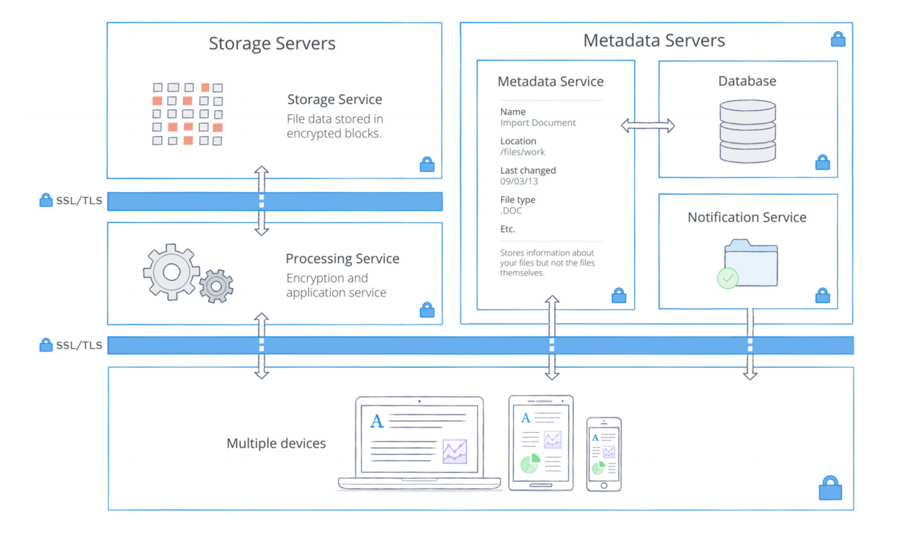
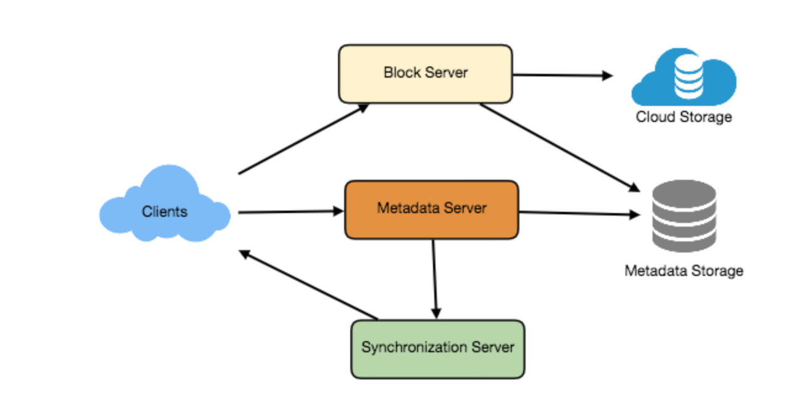
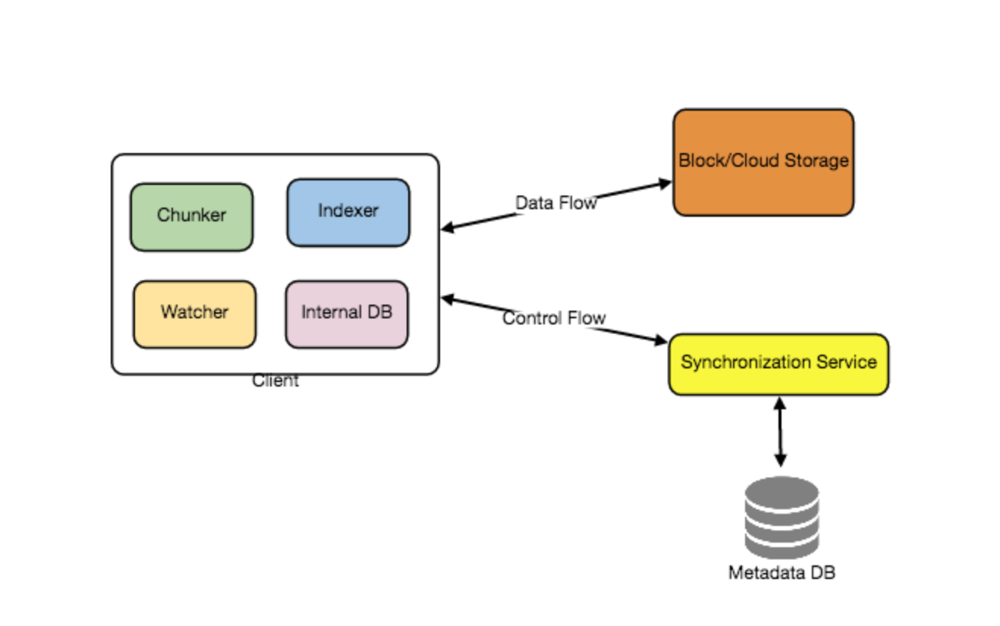
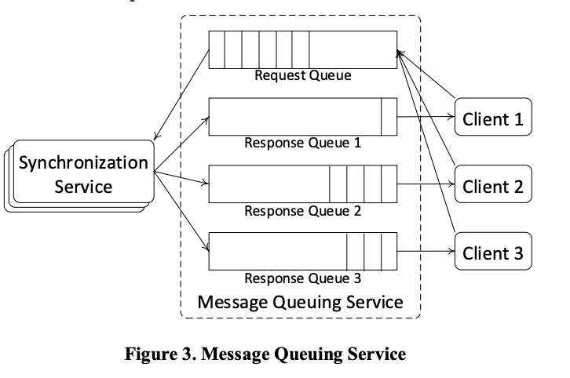
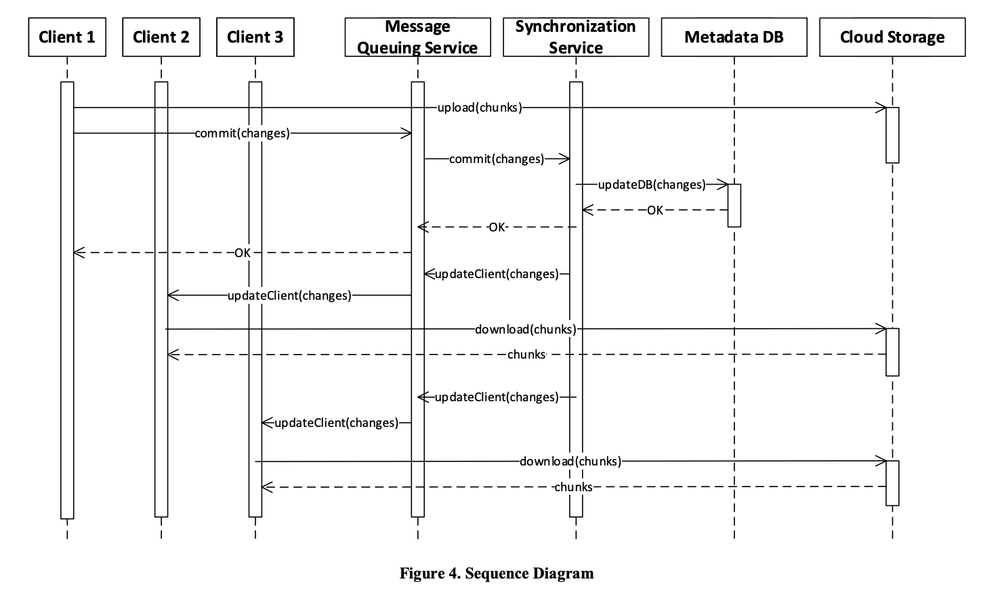

# Requirements and Goals of the System
## Functional requirements
- Users should be able to upload and download their files/photos from any device.
- Users should be able to share files or folders with other users.
- Our service should support automatic synchronization between devices, i.e., after updating a file on one device, it should get synchronized on all devices.
- The system should support storing large files up to a GB.
- ACID-ity is required. Atomicity, Consistency, Isolation and Durability of all file operations should be guaranteed.
- Our system should support offline editing. Users should be able to add/delete/modify files while offline, and as soon as they come online, all their changes should be synced to the remote servers and other online devices.
## Extended Requirements
- The system should support snapshotting of the data, so that users can go back to any version of the files.
## Non functional requirements
- We should expect huge read and write volumes.
- Read to write ratio is expected to be nearly the same.
- Overall storage space and bandwidth usage should be optimized.
- For small changes, overall upload should be optimized.
## Constraints
- Total total users: 500M
- Daily active users: 100M
- On average each user connects from three different devices
- On average user has 200 files/photos
- Average file size is 100KB
- Files can also be in size of GBs
# Related algorithm to solve could storage
## Chunking files
Split file into small chunks and store chunks on storage. It has following benefits
- All failed operation only needs to be retried on small chunks
- Reduce amount of data exchange by transferring updated chunks only
- By removing duplicate chunks, we can save storage space and network bandwidth usage.
- On change, it can determine delta change on chunk and upload diffs instead of whole chunks
### Overhead
- Need to manage order and mapping of chunks
- Need to delete chunks which are no more part of files after some change
- Need to merge all chunks to show complete file
## Fixed Size Chunking  
- Define smallest size of chunk let's say `4MB`
- Simply start splitting file as per `4MB` limit to create chunks
### Pros
- Simple approach 
- Very fast

### Cons
- Small edit on file sometime leads to disturb entire chunks boundary which generates new chunks

## Content Defined Chunking
- Generates chunks based on predetermined boundary separator 

### Pros
- On changing file, it only generates related modified chunks
- It doesn't re-generate new set of chunks
### Cons
- Compute intensive
## Differential Synchronization
- Client manage copy of data
- Server also manage copy of data
- Get diff of data by comparing copy with original data
- Manage set of patches with timestamp + author etc
- Request server to apply patches 
    - Server first apply patches on server copy data
    - if success then also apply patches on original data
    - returned 200 response code
- If server respond back with 200 code, then client apply same patches on original copy of data
- This algorithm is used by `.git` and `.svn`
- It requires manual intervention on conflict 

## Rsync
## Version management 
- Tag list of patches as version `x`
# High level System design


# Component Design
## Dropbox Client
Following are operations for the client
1. Upload and download files.
2. Detect file changes in the workspace folder.
3. Handle conflict due to offline or concurrent updates.
Following are different components for client.

### Internal Metadata Database 
- It will keep track of all the files, chunks, their versions, and their location in the file system.
### Chunker
- It will split the files into smaller pieces called chunks. 
- It will also be responsible for reconstructing a file from its chunks. 
- Our chunking algorithm will detect the parts of the files that have been modified by the user and only transfer those parts to the Cloud Storage; this will save us bandwidth and synchronization time.
### Watcher
- It will monitor the local workspace folders and notify the Indexer of any action performed by the users, e.g. when users create, delete, or update files or folders. 
- Watcher also listens to any changes happening on other clients that are broadcasted by Synchronization service.
### Indexer
- It will process the events received from the Watcher and update the internal metadata database with information about the chunks of the modified files. 
- It calls metadata server to get list of chunks which needs to be uploaded.
- It upload/download the chunks to Block/Cloud storage
- Once the chunks are successfully submitted/downloaded to the Cloud Storage, the Indexer will communicate with the remote Synchronization Service to broadcast changes to other clients and update remote metadata database.
## Metadata Database
- The Metadata Database is responsible for maintaining the versioning and metadata information about files/chunks, users, and workspaces. 
- Following is schema for file metadata
```
{
   "chunk_id":"string",
   "chunk_order":"number",
   "object":{
      "version":"number",
      "is_folder":"boolean",
      "modified":"number",
      "file_name":"string",
      "file_extention":"string",
      "file_size":"number",
      "file_path":"string",
      "user":{
         "user_name":"string",
         "email":"string",
         "quota_limit":"number",
         "quota_used":"number",
         "device":{
            "device_name":"string",
            "sync_folder":"string"
         }
      }
   }
}
```
- It will also store users data
### Metadata Database storage estimate
- Total total users: 500M
- Daily active users: 100M
- On average each user connects from three different devices
- On average user has 200 files/photos
- Average file size is 100KB
- Files can also be in size of GBs
- Avg size of one user document:  500bytes
    - Total user data storage: 500M * 500 bytes ~ 250 gb
- Avg size of one file metadata document:  1Kb
    - Total files metadata storage : 500M * 200 * 1kb ~  100 tb
    - Storage limit per server: 2TB
    - Number of shards: 50
    - Replicas for failover: 3
    - Total storage: 300TB
## Synchronization Service
### Update and notify subscriber 
- The Synchronization Service is the component that processes file updates made by a client and applies these changes to other subscribed clients. 
- It also synchronizes clients’ local databases with the information stored in the Metadata Database. 
- Desktop clients communicate with the Synchronization Service to either obtain updates from the Cloud Storage, or send files and updates to the Cloud Storage and potentially other users. 
- If a client was offline for a period of time, it polls the system for new updates as soon as it goes online. 
- When the Synchronization Service receives an update request, it checks with the Metadata Database for consistency and then proceeds with the update. 
- Subsequently, a notification is sent to all subscribed users or devices to report the file update.
### Apply diff logic to find out delta update
- As a design goal, the Synchronization Service should be designed in a way to transmit less data between clients and the Cloud Storage in order to achieve better response time. 
- To meet this design goal, the Synchronization Service should employ a differencing algorithm to reduce the volume of the data that needs to be synchronized. 
- Instead of transmitting entire files from clients to server or vice versa
- most of the file synchronization algorithms just transmit the difference between two versions of a file. 
- Therefore, only the part of the file that has been changed is transmitted. 
- This also decreases bandwidth consumption and cloud data storage for the end user.
### Synchronization algorithm
- An essential part of the Synchronization Service is a synchronization algorithm. 
- Rsync is one of the most popular and high performance algorithms of this type that is able to compute the difference among different copies of data. 
- Rsync partitions a file that is located on the server into several chunks with fixed block sizes, and uses a hash function to calculate its hash value to be sent to clients. 
- The clients then use the hash values to determine whether to update the local copy of a chunk or not. 
- Rsync is widely adopted by for data synchronization due to its simplicity and high performance
### User traffic
- Daily active users: 100M
- On average user has 200 files/photos
- On average each user connects from three different devices
- Total files: 100M * 200 * 3
- Concurrent connections per second: 100M * 200 * 3 /(24*60*60) ~ 700K / second
- Need to add messaging queue to handle traffic

## Message Queuing Service

- An important part of our reference architecture is a messaging middleware that should be able to handle a substantial amount of reads and writes. 
- The Message Queuing Service supports asynchronous and
loosely coupled message-based communication between
distributed components of the system. 
- The Message Queuing Service
also provides load balancing and elasticity for multiple
instances of the Synchronization Service
- The Request Queue is a global queue that is shared among all clients.
-  Clients’ requests to update the Metadata Database through the Synchronization Service will be sent to the Request Queue. 
- The Response Queues responsible for delivering the update messages to each client. 
## Cloud/Block Storage
- Cloud Storage stores the chunks of the files uploaded by the client.
- Clients directly interact with the Cloud Storage to send and receive objects using the API. 
### Cloud/Block Storage Estimate
- Total total users: 500M
- On average each user connects from three different devices
- On average user has 200 files/photos
- Average file size is 100KB
- Total storage: 500M * 200 * 100KB ~ 10PB 
- Let's assume 30% will be duplicate files
- Total storage as per deduped design: 7PB
- Server storage limit: 10TB
- Number of servers for storage: 700
- Add 3 replicas for failover: 2100
- Total storage: 21PB
### User traffic
- Daily active users: 100M
- On average user has 200 files/photos
- On average each user connects from three different devices
- Total files: 100M * 200 * 3
- Concurrent connections per second: 100M * 200 * 3 /(24*60*60) ~ 700K / second
### Cache
- Due to high traffic, need to apply Cache
# Overall file processing flow
- The following sequence diagram shows the interaction between the components of the application in a scenario when Client 1 updates a file that is shared with Client 2 and 3, so they should receive the update too. 
- If the other clients were not online at the time of the update, the Message Queuing Service keeps the update notifications in separate response queues for them until they become online at a later time.


# Security, Permissions and File Sharing
- To handle this, we will be storing the permissions of each file in our metadata DB to reflect what files are visible or modifiable by any user.
# Reference 
http://auduboncharterschools.org/wp-content/uploads/2016/07/Dropbox_Security-Whitepaper_2015.pdf


